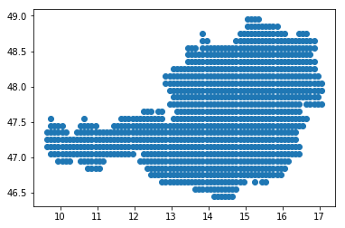
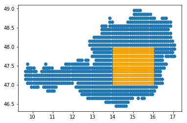

Subsetting grids using shapefiles.
----------------------------------

.. code:: ipython2

    import pygeogrids.grids as grids
    import pygeogrids.shapefile as shapefile
    import numpy as np

.. code:: ipython2

    testgrid = grids.genreg_grid(0.1, 0.1)

We can now subset the 0.1x0.1 degree regular grid with the shapefiles
from http://biogeo.ucdavis.edu/data/gadm2.8/gadm28\_levels.shp.zip which
were downloaded to ``~/Downloads/gadm``

.. code:: ipython2

    austria = shapefile.get_gad_grid_points(testgrid, '/home/cpa/Downloads/gadm/',
                                  0, name='Austria')

We can the plot the resulting grid using a simple scatterplot.

.. code:: ipython2

    import matplotlib.pyplot as plt
    %matplotlib inline
    plt.scatter(austria.arrlon, austria.arrlat)

Behind the scenes this functionality uses the ``get_shp_grid_points``
function of the grid object.

We can also use this directly using any ``ogr.Geometry`` object.

.. code:: ipython2

    ring = ogr.Geometry(ogr.wkbLinearRing)
    ring.AddPoint(14, 47)
    ring.AddPoint(14, 48)
    ring.AddPoint(16, 48)
    ring.AddPoint(16, 47)
    ring.AddPoint(14, 47)
    
    poly = ogr.Geometry(ogr.wkbPolygon)
    poly.AddGeometry(ring)
    subgrid = austria.get_shp_grid_points(poly)
    plt.scatter(austria.arrlon, austria.arrlat)
    plt.scatter(subgrid.arrlon, subgrid.arrlat, c='orange')

